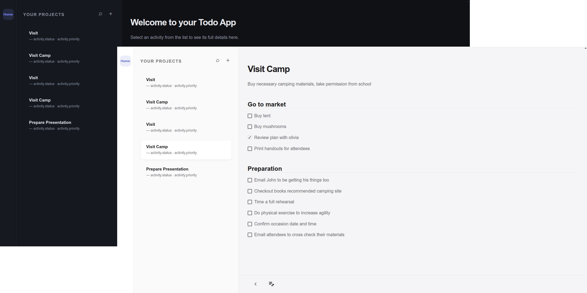

# 📋 TodoFlow — Project & Task Manager

A clean, fast, and intuitive project management application built with vanilla TypeScript. Features a modern dashboard layout with project lists, rich task management, and smooth interactions.

 

## ✨ Features

- **Project Management**: Create, view, edit, and organize multiple projects
- **Nested Tasks**: Subtasks with individual task items
- **Progress Tracking**: Mark tasks as complete with visual feedback
- **Responsive Design**: Works beautifully on desktop and mobile
- **Persistent Storage**: Data saved automatically in browser's localStorage
- **Smooth UX**: View transitions, dynamic form fields, and clean animations
- **Keyboard & Click Friendly**: Built with event delegation for great performance

## 🛠️ Tech Stack

- **TypeScript**
- **Webpack 5** (bundling & development server)
- **Custom Recursive DOM Builder** (zero external UI frameworks)
- **CSS Variables** + Modern CSS (Flexbox, Grid, Custom Properties)
- **Vitest** (Testing)

## 📁 Project Structure

```text
src/
├── index.html
├── index.ts
├── scripts/
│   ├── store/              # Data layer + persistence
│   ├── model/              # Business logic & transformers
│   ├── view/               # Rendering engine + utilities
│   └── controller/         # Event handlers
├── styles/                 # Modular CSS
│   ├── reset.css
│   ├── colorScheme.css
│   └── dashBoard/
└── test/                   # Unit tests
```

## 🚀 Getting Started

### 1. Clone the repository
```bash
git clone https://github.com/zololade/Todo-App.git
cd Todo-App   # or your project folder name
```

### 2. Install dependencies
```bash
npm install
```

### 3. Run development server
```bash
npm start
```
Open [http://localhost:4000](http://localhost:4000)

### 4. Build for production
```bash
npm run build
```

## 🎯 How to Use

1. **Add a Project** → Click the `+` button in the projects panel
2. **Fill in details** → Project title, overview, and add subtasks/tasks
3. **Save** → Click the save icon
4. **Manage Tasks** → Click any task to mark as complete
5. **Edit** → Open a project and click the edit button
6. **Mobile** → Use the back button to toggle between list and detail view

## 🧪 Running Tests

```bash
npm test
```

## Roadmap (Future Enhancements)

- [ ] Delete projects and tasks
- [ ] Search and filter
- [ ] Due dates & priorities
- [ ] Dark/Light theme toggle
- [ ] Drag & drop reordering
- [ ] Data export/import
- [ ] Statistics dashboard

## 📄 License

This project was built as part of **The Odin Project** curriculum.
